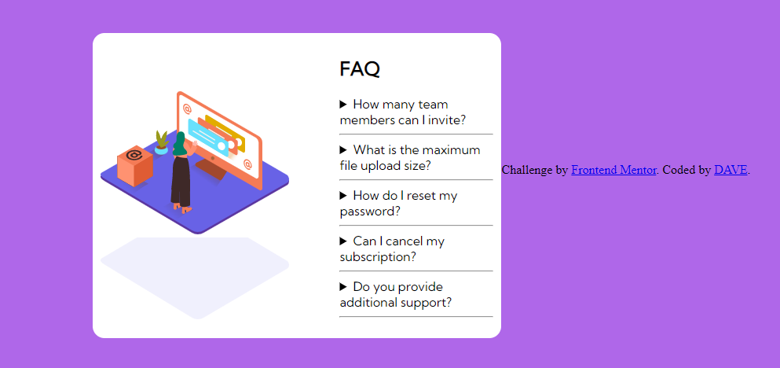

# Frontend Mentor - FAQ accordion card solution

This is a solution to the [FAQ accordion card challenge on Frontend Mentor](https://www.frontendmentor.io/challenges/faq-accordion-card-XlyjD0Oam). Frontend Mentor challenges help you improve your coding skills by building realistic projects. 

## Table of contents

- [Overview](#overview)
  - [The challenge](#the-challenge)
  - [Screenshot](#screenshot)
  - [Links](#links)
- [My process](#my-process)
  - [Built with](#built-with)
  - [What I learned](#what-i-learned)
  - [Continued development](#continued-development)
  - [Useful resources](#useful-resources)
- [Author](#author)
- [Acknowledgments](#acknowledgments)

## Overview

### The challenge

Users should be able to:

- View the optimal layout for the component depending on their device's screen size
- See hover states for all interactive elements on the page
- Hide/Show the answer to a question when the question is clicked

### Screenshot

### Links

- Solution URL: [Add solution URL here](https://your-solution-url.com)
- Live Site URL: [Add live site URL here](https://your-live-site-url.com)

## My process

### Built with

- Semantic HTML5 markup
- CSS custom properties
- Flexbox
- CSS Grid

### What I learned

I learnt how to create Accordions using just html and css 

### Continued development

I would like to perfect my css styles

### Useful resources

- [Example resource 1](https://www.w3schools.com/js/js_intro.asp) - This helped me undestand javascript reason. I really liked this pattern and will use it going forward.
- [Example resource 2](https://www.freecodecamp.org/learn/javascript-algorithms-and-data-structures/basic-javascript/add-two-numbers-with-javascript) - This is an amazing article which helped me finally understand Javascript. I'd recommend it to anyone still learning this concept.

## Author

- Website - [Add your name here](https://www.your-site.com)
- Frontend Mentor - [@yourusername](https://www.frontendmentor.io/profile/Dammie0)
- Twitter - [@yourusername](https://www.twitter.com/d_ebus)

